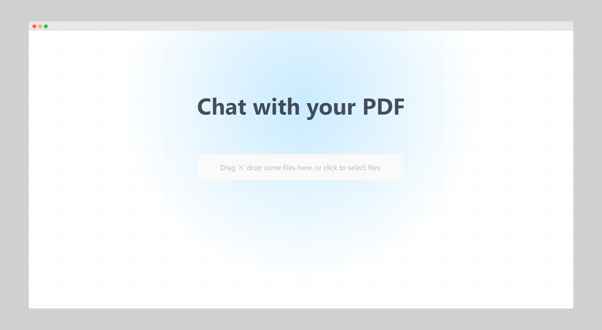

## Astro Web con Cloudinary y PDF

## Descripción

Este proyecto es una aplicación web que utiliza Astro, una herramienta de desarrollo de sitios web, y Cloudinary, una plataforma de gestión de archivos multimedia, para procesar y mostrar archivos PDF.

## Requisitos

Para ejecutar este proyecto, necesitarás tener instalado Node.js y npm.

## Instalación

1. Clona el repositorio en tu máquina local.
2. Navega a la carpeta del proyecto.
3. Instala las dependencias del proyecto.

## Configuración

1. Configura las variables de entorno.

Crea un archivo `.env` en la raíz del proyecto y agrega las siguientes variables de entorno:

## Configuración

1. Configura las variables de entorno.

Crea un archivo `.env` en la raíz del proyecto y agrega las siguientes variables de entorno:

2. Configura Cloudinary.

Registra una cuenta en Cloudinary y obtén tu API key y API secret. Luego, actualiza el archivo `src/pages/api/upload.ts` con tus credenciales.

## Ejecución

1. Inicia el servidor de desarrollo.

2. Abre tu navegador y navega a `http://localhost:3000`.

## Características

- Sube archivos PDF a Cloudinary.
- Procesa los archivos PDF subidos y muestra su contenido.
- Utiliza Astro para la construcción de la interfaz de usuario.
- Utiliza Cloudinary para la gestión de archivos multimedia.

## Contribución

Si deseas contribuir a este proyecto, por favor sigue las siguientes pautas:

1. Crea una rama nueva.
2. Realiza tus cambios.
3. Crea una solicitud de extracción.

## Licencia

Este proyecto está licenciado bajo la licencia MIT.

## Contacto

Si tienes alguna pregunta o comentario, por favor contacta a [tu-email@example.com](mailto:tu-email@example.com).

